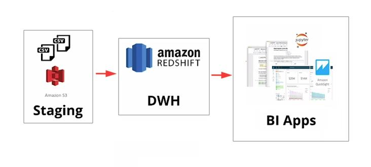

# AWS Cloud Data Warehouse

In the Era of Data is essential to understand how to translate business processes into data requirements, to help people have access data and create insights to the company. A fictional startup called Sparkify has been collecting song and user data in its brand new app. And as in many startups, they went from MVP to scale in a couple of months and the tech infrastructure didn't follow. Therefore, now they have all data saved in JSON files and the analytics team is trying to understand song trends.

This project aims to create a Data Warehouse using AWS Cloud.  We are going to build a ETL pipeline to extract data from a S3 Bucket and move data to a Redshift Cluster. To achieve this, Infrastructure as Code (IaC) was used to simplify and automate the whole process and a Star schema was chosen because it is the most used model in dimensional modeling to support decision making and improve the performance of consultation-oriented systems. 




## Project Instructions

All of the starting code and resources you'll need to compete this project are in this Github repository. Before you can get started coding, you'll have to make sure that you have all the libraries and dependencies required to support this project;

- psycopg2
- pandas
- boto3

### Data

The files are the .py files, used to create tables and populate them. Furthermore, scripts for launching a Redshift Cluster and deleting it, are provided.  
They are organized as follows:
.
└── aws-data-warehouse/
    ├── create_tables.py
    ├── etl.py
    ├── sql_queries.py
    ├── delete_redshift.py
    ├── setup_redshift.py
    ├── dwh.cfg
    └── README.md

The JSON files are in a S3 Bucket and the path are defined in the `dwh.cfg`:

````
[S3]
LOG_DATA=s3://udacity-dend/log_data
LOG_JSONPATH=s3://udacity-dend/log_json_path.json
SONG_DATA=s3://udacity-dend/song_data
````

### Description

How to get started:

- Create a new IAM user in your AWS account
- Give it `AdministratorAccess`, From `Attach existing policies directly` Tab
- Take note of the access key and secret 
- Edit the file `dwh.cfg` in the same folder as this notebook and fill
- Lauch the Redshift Cluster using the AWS python SDK, running `python setup_redshift.py`
- Create the database or drop old versions. For this you can run `python create_tables.py` from the terminal in the projects folder, which will make a connection, drop old database if exists, create the tables and close the connection. 
- After that, we are able to populate the database using `python etl.py`. This will rCOPY all the json files and insert the information in the staging tables. From that, the script will INSERT this information to fact and dimensions tables. 
- **IMPORTANT**: DO NOT FORGET TO RUN `python delete_redshift.py` AFTER PERFORM ALL OPERATION YOU WISH!

Here is what a line of the Song JSON looks like:

`{"num_songs": 1, "artist_id": "ARJIE2Y1187B994AB7", "artist_latitude": null, "artist_longitude": null, "artist_location": "", "artist_name": "Line Renaud", "song_id": "SOUPIRU12A6D4FA1E1", "title": "Der Kleine Dompfaff", "duration": 152.92036, "year": 0}`

The events dataset, on other hand, is a JSON with a lot of data captured from the app. Here is what it looks like when read as a dataframe using pandas:

| artist   | auth      | firstName | gender | iteminSession | lastName | length   | location          | method | page     | registration | sessionId | song                 | status | ts            | userAgent                                     | userId |
| -------- | --------- | --------- | ------ | ------------- | -------- | -------- | ----------------- | ------ | -------- | ------------ | --------- | -------------------- | ------ | ------------- | --------------------------------------------- | ------ |
| Pavement | Logged In | Sylvie    | F      | 0             | Cruz     | 99.16036 | Klamath Falls, OR | PUT    | NextSong | 1.541078e+12 | 438       | Mercy:The Laundromat | 200    | 1541990258796 | "Mozila/6.0(Macintosh; Intel Mac OS X 10_9_4" | 10     |

Using both JSON files loaded in staging tables, five tables were created using Pandas and SQL. Furthermore, DISTKEYs and SORTKEYs were used to optimize table designs. All queries can be found at `sql_queries.py`. 

### Fact Table

- songplays - records in log data associated with song plays i.e. records with page NextSong
  *songplay_id, start_time, user_id, level, song_id, artist_id, session_id, location, user_agent*

### Dimension Tables

- users - users in the app
  *user_id, first_name, last_name, gender, level*
- songs - songs in music database
  *song_id, title, artist_id, year, duration*
- artists - artists in music database
  *artist_id, name, location, latitude, longitude*
- time - timestamps of records in songplays broken down into specific units
  *start_time, hour, day, week, month, year, weekday*

With the data warehouse running on the cloud, here is how easy it is now to better understanding the paying audience from Sparkfly:

```SQL
SELECT gender, level, COUNT(user_id) 
FROM users 
GROUP BY gender, level;
```

| gender | level | count |
| -----: | ----: | ----: |
|      M |  free |    35 |
|      F |  free |    41 |
|      F |  paid |    14 |
|      M |  paid |     6 |

If no effort is easy to understand the womans are more inclined to pay for premium features. And with this query they can see the top 5 songs:

```SQL 
SELECT s.song_id, s.title, a.name artist, COUNT(sp.song_id) n_plays 
FROM songplays sp 
    JOIN songs s ON s.song_id = sp.song_id 
    JOIN artists a ON a.artist_id = sp.artist_id 
GROUP BY s.song_id, s.title, a.name 
ORDER BY n_plays DESC
LIMIT 5
```